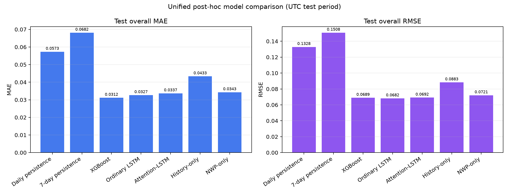

# 基于历史功率与数值天气预报的光伏日前功率预测

本仓库实现并评估一个严格防止信息泄漏的 24→24 小时光伏日前功率预测任务：比较持续性基线、XGBoost、Seq2Seq LSTM 与 Temporal-Attention LSTM，并通过统一时间切分、三随机种子、输入消融和配对日期块 bootstrap 检验结果的稳定性。公开内容聚焦可复现的数据处理、模型比较、统计评估及其适用边界。

## 核心结论

- **XGBoost 的测试 MAE 最低**：`0.031186 ± 0.000199`。相对普通 LSTM 的 MAE 差值区间不跨 0，支持其较低平均绝对误差。
- **普通 LSTM 的测试 RMSE 点估计最低**：`0.068195 ± 0.000561`，比 XGBoost 低约 `1.1%`；但 7 天配对日期块 bootstrap 的差值区间跨 0，因此不足以声称稳定 RMSE 优势。
- **Temporal-Attention LSTM 没有带来总体增益**：其测试 MAE/RMSE 均差于普通 LSTM；三种子聚合后的注意力权重近似均匀，未呈现一致的历史时刻偏好。
- **历史功率与未来 NWP 具有互补预测价值**：History-only 和 NWP-only 的测试 RMSE 分别为 `0.088319` 和 `0.072061`，均差于完整输入 LSTM；在本实验中，移除 NWP 的损失更大。

| 模型 | 测试 MAE | 测试 RMSE | 说明 |
|---|---:|---:|---|
| 前一日持续性 | 0.057323 | 0.132836 | 更强的确定性基线 |
| 7 日季节性持续性 | 0.068158 | 0.150790 | 确定性基线 |
| XGBoost | **0.031186 ± 0.000199** | 0.068945 ± 0.000303 | MAE 最低 |
| 普通 LSTM | 0.032660 ± 0.000830 | **0.068195 ± 0.000561** | RMSE 点估计最低 |
| Temporal-Attention LSTM | 0.033690 ± 0.002231 | 0.069177 ± 0.001315 | 总体性能负结果 |
| History-only LSTM | 0.043347 | 0.088319 | 事后探索性消融 |
| NWP-only LSTM | 0.034300 | 0.072061 | 事后探索性消融 |

学习模型报告随机种子 `42/2026/3407` 的指标均值 ± 样本标准差；输入消融表中的数值同样为三种子指标均值。配对 bootstrap 在每个重采样日期窗口内逐种子重算整体指标，再对种子指标求均值，与主表聚合口径一致。完整证据、区间和解释边界见[中文技术报告](docs/technical_report_zh.md)与[英文技术报告](docs/technical_report_en.md)。



## 1. 固定预测任务

- 输入：预测时刻之前连续 24 小时的光伏功率，以及预测时刻能够获得的未来 24 小时 NWP（数值天气预报）变量。
- 输出：未来 24 个小时的光伏功率预测值。
- 任务类型：日前多步时间序列预测。
- 核心要求：任何输入特征都必须在预测时刻真实可获得，禁止使用未来实测天气或未来真实功率。

完整的数据、模型和评价定义见[中文技术报告](docs/technical_report_zh.md)。

## 2. 固定模型

项目核心阶段只比较以下五类模型：

1. Persistence：持续性基线。
2. Seasonal Persistence：季节性持续基线。
3. XGBoost：树模型基线。
4. LSTM：深度学习时序基线。
5. Temporal-Attention LSTM：加入时序注意力的主模型。

在核心结果完成前，不增加 STGCN、Transformer、概率预测或多种注意力机制。

## 3. 固定评价指标

- MAE
- RMSE
- 容量归一化 nRMSE（%）：由于 `POWER` 是相对场站标称容量的归一化功率，计算为 `100 × RMSE`。
- 有效辐照时段 MAE、RMSE 与容量归一化 nRMSE：固定使用预测时点可获得的 `VAR169` 逐小时太阳辐照增量大于 0 作为掩码，不使用未来实测功率定义时段。

所有学习模型使用三个随机种子：`42`、`2026`、`3407`。最终结果报告均值和标准差。

## 4. 项目目录

```text
renewable-power-forecasting/
|-- configs/             # 固定实验配置
|-- data/
|   |-- raw/             # 原始数据，不上传 Git
|   |-- interim/         # 清洗后的中间数据
|   `-- processed/       # 可直接用于训练的数据
|-- docs/                # 项目说明与数据审计文档
|-- notebooks/           # 探索性分析
|-- scripts/             # 环境检查及后续执行脚本
|-- tests/               # 项目契约和功能测试
|-- artifacts/
|   `-- checkpoints/     # 模型权重，不上传 Git
|-- reports/
|   `-- figures/         # 最终图表
|-- requirements.txt
`-- README.md
```

## 5. 环境使用

建议使用 Python 3.11；环境检查脚本接受 Python 3.10–3.12。Windows PowerShell：

```powershell
py -3.11 -m venv .venv
.\.venv\Scripts\Activate.ps1
python -m pip install --upgrade pip
python -m pip install -r requirements.txt
```

Linux/macOS：

```bash
python3.11 -m venv .venv
source .venv/bin/activate
python -m pip install --upgrade pip
python -m pip install -r requirements.txt
```

正式实验已在 Python `3.11.16`、PyTorch `2.11.0+cu128`、XGBoost `3.2.0` 和 RTX 5080 上核验。训练配置默认请求 CUDA；没有兼容 GPU 时，自动化测试仍可在 CPU 运行，但完整训练需在本地配置副本中把 XGBoost、LSTM 和 Attention-LSTM 的 `device` 改为 `cpu`。安装特定 CUDA 构建时请使用 [PyTorch 官方安装器](https://pytorch.org/get-started/locally/)，不要改变其他实验参数。

检查环境：

```powershell
python scripts/check_environment.py
```

运行测试：

```powershell
python -m pytest -q
```

原始 GEFCom2014 Solar 数据不随仓库分发。按照[数据准备说明](data/README.md)下载官方附件，并确保规范输入文件位于：

```text
data/raw/gefcom2014/solar/Solar/Task 15/predictors15.csv
```

生成无泄漏的 24→24 预处理数据：

```powershell
python scripts/preprocess_data.py --config configs/day_ahead.yaml
```

脚本只在训练集拟合 NWP 标准化统计量，并把累计气象字段转换为逐小时非负增量。生成的数据与原始数据均由 `.gitignore` 排除，不会上传公开仓库。

评估前一日持续性和 7 日季节性持续性基线：

```powershell
python scripts/evaluate_baselines.py --config configs/day_ahead.yaml
```

指标保存在 `artifacts/baselines/metrics.json`，预测示例和分预测时距 RMSE 曲线保存在 `reports/figures/`。完整结果及解释见 [基线评估记录](docs/baseline_results.md)。

训练并评估 XGBoost：

```powershell
python scripts/train_xgboost.py --config configs/day_ahead.yaml
```

脚本只根据验证集 RMSE 从固定候选中选择参数，参数确定后才读取测试集，并使用 `42`、`2026`、`3407` 三个随机种子重训。指标保存在 `artifacts/xgboost/metrics.json`，完整说明见 [XGBoost 评估记录](docs/xgboost_results.md)。

训练并评估普通 Seq2Seq LSTM：

```powershell
python scripts/train_lstm.py --config configs/day_ahead.yaml
```

脚本使用训练集拟合参数、只根据验证集 MSE 早停并恢复最佳权重，测试集仅用于最终评估。三个随机种子的 checkpoint 保存在 `artifacts/checkpoints/`，指标保存在 `artifacts/lstm/metrics.json`，完整说明见 [普通 LSTM 评估记录](docs/lstm_results.md)。

训练并评估 Temporal-Attention LSTM：

```powershell
python scripts/train_attention_lstm.py --config configs/day_ahead.yaml
```

该脚本保持普通 LSTM 的输入、训练规则和评价协议，只增加对 24 个历史编码状态的 Bahdanau 加性注意力。验证集 RMSE 是预先固定的首要判断指标，测试集只作最终评估；指标和平均注意力权重保存在 `artifacts/attention_lstm/`，完整说明见 [Attention-LSTM 评估记录](docs/attention_lstm_results.md)。

运行固定的 History-only 与 NWP-only 输入消融：

```powershell
python scripts/train_lstm_ablations.py --config configs/day_ahead.yaml
```

生成统一诊断、3/7/14天配对移动块 bootstrap 和比较图：

```powershell
python scripts/run_exploratory_analysis.py --config configs/day_ahead.yaml
```

这些补充结果是在查看主测试结果后开展的探索性分析，不用于重新选择主模型。完整中英文说明见 [输入消融与统一探索性评估](docs/exploratory_analysis_results.md) 和 [English summary](docs/exploratory_analysis_results_en.md)。

完整训练会覆盖本地生成的指标、预测数组、checkpoint 和图表；如只阅读仓库，可直接查看已保留的紧凑 JSON 指标和 PNG 图表。

## 6. 数据与防泄漏规则

1. 数据必须按时间顺序划分训练集、验证集和测试集，不能随机打乱后划分。
2. 标准化器、缺失值填补参数和特征统计量只能在训练集上拟合。
3. 测试集不能参与调参或模型选择。
4. NWP 必须是预测时刻可获得的预报值，不能用未来实测天气替代。
5. 原始数据、模型权重和大体积临时文件不得上传公开仓库。
6. 原始 `TIMESTAMP`、预测起点、目标时刻和日历特征统一使用 UTC。由于场站精确位置未公开，不推测当地时区，也不把 UTC 小时直接称为白天或夜间。

## 7. 注意力结果的正确表述

注意力权重可以用于展示模型在不同历史时刻上的关注程度，但不能直接解释为某个气象变量对预测结果的因果贡献。变量贡献分析由 XGBoost 特征重要性或后续的 SHAP 分析承担，同样只作模型解释，不作因果结论。

## 8. 项目产物

仓库提供以下可审计材料：

- 一个可复现的 GitHub 项目仓库。
- 一份数据来源与数据质量审计记录。
- 五类模型的统一对比表。
- 预测曲线、误差分布、分时段误差和注意力热力图。
- 中英文技术报告和各模型实验记录。

推荐阅读顺序：

1. [中文技术报告](docs/technical_report_zh.md) / [English technical report](docs/technical_report_en.md)
2. [数据来源记录](docs/data_source_record.md)与[数据审计报告](docs/data_audit.md)
3. [基线](docs/baseline_results.md)、[XGBoost](docs/xgboost_results.md)、[普通 LSTM](docs/lstm_results.md)与[Attention-LSTM](docs/attention_lstm_results.md)结果记录
4. [输入消融与统一探索性评估](docs/exploratory_analysis_results.md) / [English exploratory analysis](docs/exploratory_analysis_results_en.md)

## 9. 许可证、数据与发布边界

GEFCom2014 Solar 可从 [IEEE PES 数据共享目录](https://ieee-pes-data-sharing.org/datasets/detail/b1680aa5-a4b8-4423-8760-e509094cacec)和对应[论文](https://doi.org/10.1016/j.ijforecast.2016.02.001)获取。来源页标记为公开访问，但未列出明确许可证，因此本项目不重新分发原始数据。

本仓库中项目所有者有权授权的代码和配套原创内容采用 [MIT License](LICENSE)。该许可仅覆盖版权持有人有权授权的部分；第三方软件、依赖项及其他第三方内容继续适用各自的许可证、版权与署名要求。

GEFCom2014 数据不受本仓库 MIT 许可证覆盖，也不随仓库分发。使用者须从原始来源获取数据，并自行遵守其适用条款。详细下载与校验说明见[数据准备文档](data/README.md)。

注意力权重和树模型特征重要性均是描述性模型量，不是因果证据。测试集只覆盖 2014 年 4–6 月，结论不能直接外推到其他季节、地区或电站。没有可信场站拓扑，因此未增加 STGCN；更复杂的模型本身不等同于更强证据。

## 10. 当前进度

- [x] 项目任务固定
- [x] Python 独立环境建立
- [x] CUDA 和 RTX 5080 验证
- [x] 项目目录、Git 与测试框架建立
- [x] 数据源和使用许可核验
- [x] 数据字段与时间可用性审计
- [x] 累计 NWP 转逐小时增量与异常审计
- [x] 三站点 24→24 窗口、固定时间切分与训练集专用标准化
- [x] 前一日持续性与 7 日季节性持续性基线
- [x] XGBoost 候选选择、三随机种子训练与特征重要性
- [x] 普通 Seq2Seq LSTM 训练、三随机种子评估与复现审计
- [x] Temporal-Attention LSTM 三随机种子训练、注意力审计与公平比较
- [x] History-only/NWP-only 输入消融、配对时间块 bootstrap 与统一可视化
- [x] 最终中英文技术报告整理

当前已经生成训练、验证和测试样本 `1917/270/273` 个。内部代码和产物审计已完成；仓库采用 MIT 许可证，公开发布仍需创建首个提交，并在干净克隆中执行最终复现检查。
