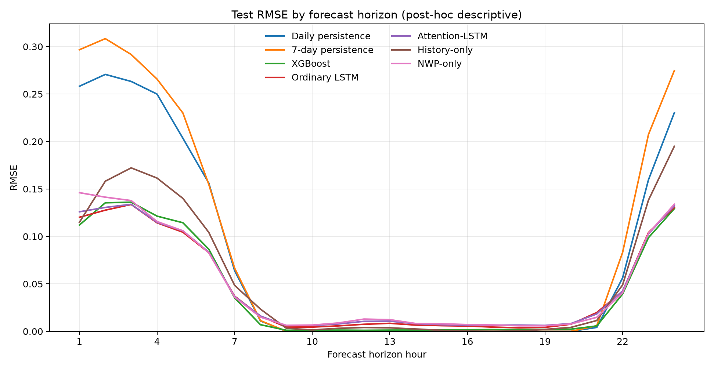
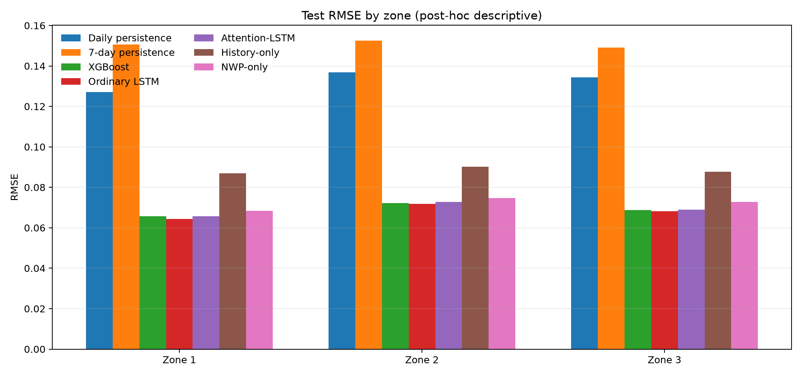
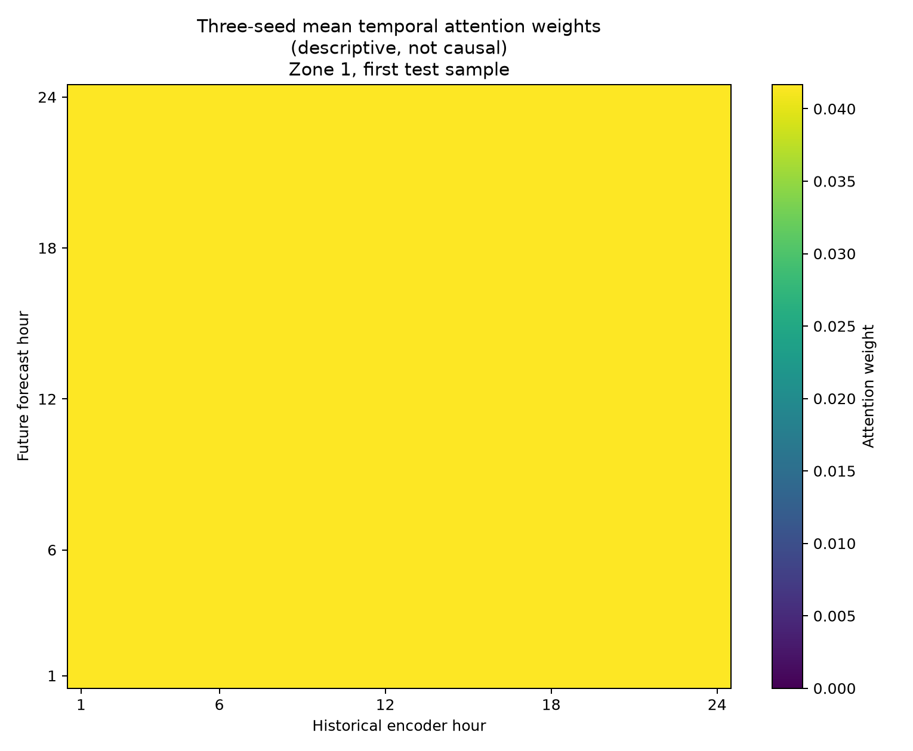

# Day-Ahead Photovoltaic Power Forecasting with Historical Power and Numerical Weather Prediction

## Technical summary

This project develops and audits a fixed 24-to-24-hour photovoltaic point-forecasting task. At each `00:00 UTC` forecast origin, the models use the previous 24 hours of power, the next 24 hours of forecast-origin-available ECMWF numerical weather prediction (NWP), UTC calendar features, and a site identifier to predict the next 24 hours of normalized power for three solar zones. The chronological train/validation/test split contains `1,917/270/273` site-day samples. Preprocessing parameters are fitted on training data only, model selection and early stopping use validation data only, and the test set is reserved for final evaluation.

The evidence does not identify one model as uniformly best. XGBoost has the lowest test MAE, `0.031186 ± 0.000199`. The ordinary Seq2Seq LSTM has the lowest RMSE point estimate, `0.068195 ± 0.000561`, about `1.1%` below XGBoost. A paired 7-day UTC date-block bootstrap, however, estimates the ordinary-LSTM-minus-XGBoost RMSE difference as `−0.000749` with a 95% interval of `[−0.002865, 0.001653]`; the available test window therefore does not establish a stable LSTM RMSE advantage. The corresponding MAE difference is `+0.001474`, with `[0.000549, 0.002393]`, supporting XGBoost's lower MAE.

Explicit Bahdanau temporal attention does not improve overall test performance. Attention-LSTM is worse than the ordinary LSTM on both test metrics, while the three-seed-aggregated weights are nearly uniform across the 24 historical states and show no consistent aggregate preference. This aggregate result does not rule out seed-specific or sample-specific selective patterns that cancel during averaging. History-only and NWP-only ablations are both worse than the full-input LSTM, supporting complementary predictive information from the two input groups; removing NWP causes the larger loss. The ablations, subgroup diagnostics, and bootstrap analysis are post-hoc exploratory analyses conducted after the primary test results were observed. They explain model behavior but do not reselect the primary model.

## 1. XGBoost retains the lower average absolute error; the LSTM RMSE advantage is only a point estimate

All models use the same test origins and targets. Learning-model values are the mean ± sample standard deviation across fixed seeds `42/2026/3407`; persistence baselines are deterministic.

| Model | Test MAE | Test RMSE | Capacity nRMSE | Interpretation |
|---|---:|---:|---:|---|
| Day-ahead persistence | 0.057323 | 0.132836 | 13.284% | Stronger simple baseline |
| 7-day seasonal persistence | 0.068158 | 0.150790 | 15.079% | Weaker baseline |
| XGBoost | **0.031186 ± 0.000199** | 0.068945 ± 0.000303 | 6.894% ± 0.030% | Lowest MAE |
| Ordinary LSTM | 0.032660 ± 0.000830 | **0.068195 ± 0.000561** | **6.820% ± 0.056%** | Lowest RMSE point estimate |
| Attention-LSTM | 0.033690 ± 0.002231 | 0.069177 ± 0.001315 | 6.918% ± 0.132% | Does not beat the ordinary LSTM |


Relative to day-ahead persistence, the ordinary LSTM reduces test RMSE by `48.66%`, and XGBoost reduces it by `48.10%`. Both learning approaches therefore provide substantial value over the simple baseline. The difference between them is much smaller: the LSTM places more weight on avoiding large errors and has a slightly lower RMSE, whereas XGBoost has the lower typical absolute error. Paired date-block uncertainty supports only the latter direction in the available test period.

Evidence: [baseline metrics](../artifacts/baselines/metrics.json), [XGBoost metrics](../artifacts/xgboost/metrics.json), [ordinary-LSTM metrics](../artifacts/lstm/metrics.json), and [Attention-LSTM metrics](../artifacts/attention_lstm/metrics.json).

## 2. A fixed forecast-origin contract makes the comparison auditable

### Data source and scope

The GEFCom2014 Solar Track contains hourly normalized solar power and 12 ECMWF NWP variables for three nearby Australian zones. The canonical panel spans `2012-04-01 01:00 UTC` to `2014-07-01 00:00 UTC` and contains `59,112` rows, with no missing values, duplicate zone-time records, or non-hourly gaps. Exact zone locations are undisclosed, so the project retains UTC and does not infer local clock time.

The data are distributed with the [GEFCom2014 paper](https://doi.org/10.1016/j.ijforecast.2016.02.001) and indexed by the [IEEE PES data-sharing directory](https://ieee-pes-data-sharing.org/datasets/detail/b1680aa5-a4b8-4423-8760-e509094cacec). The source page does not specify a redistribution license, so neither raw nor processed data are included in this repository. Hashes, fields, and distribution boundaries are documented in the [data-source record](data_source_record.md).

### Inputs, target, and chronological split

For each forecast origin `t`:

- historical input: power from `t−23` through `t`;
- known-future inputs: 12 NWP variables and four UTC cyclical calendar features from `t+1` through `t+24`;
- target: power from `t+1` through `t+24`;
- common output bound: `[0,1]`.

| Split | Forecast-origin dates | Samples per zone | Total site-day samples |
|---|---|---:|---:|
| Training | 2012-04-02 to 2013-12-31 | 639 | 1,917 |
| Validation | 2014-01-01 to 2014-03-31 | 90 | 270 |
| Test | 2014-04-01 to 2014-06-30 | 91 | 273 |

Accumulated NWP variables `VAR169/175/178/228` are converted to hourly increments within each zone-forecast-day group. Negative increments are audited before clipping at physically non-negative bounds. NWP scaling statistics are estimated from training data only. Future observed power is never used as an input, and validation or test labels do not affect preprocessing parameters.

### Metric definitions

- **MAE** is the mean absolute error and is relatively insensitive to a small number of large misses.
- **RMSE** is the square root of the mean squared error and penalizes larger misses more strongly.
- **Capacity nRMSE** is `100 × RMSE` because the target is normalized by nominal capacity.
- **Irradiance-active metrics** recompute MAE and RMSE where the forecast input's hourly `VAR169` increment is greater than zero. The mask does not read the future power label.

Both full-window and irradiance-active metrics are reported so that numerous zero-power points do not hide errors under irradiance-active conditions.

## 3. The model protocol isolates the tested structural change

### Persistence baselines

Day-ahead persistence uses the same-zone power observed 24 hours earlier. Seven-day seasonal persistence uses the same-zone, same-hour value from seven days earlier. These parameter-free baselines establish whether the learning models add value beyond repetition rules.

### XGBoost

Each target hour becomes one supervised row with 44 features: 24 power lags, the target hour's 12 NWP variables, four cyclical calendar features, forecast horizon, and three zone one-hot indicators. Three candidates are fixed in advance and compared only by validation RMSE. The selected configuration uses depth 6, learning rate `0.03`, and up to 800 trees; the test split is read only after selection, followed by three-seed refitting.

### Ordinary Seq2Seq LSTM

A one-layer, 64-unit encoder reads `[B,24,1]` historical power. A one-layer decoder receives future NWP, UTC calendar features, and a four-dimensional zone embedding. The encoder's final hidden and cell states initialize the decoder; teacher forcing is not used. The fixed optimizer protocol is Adam with learning rate `1e-3`, weight decay `1e-5`, batch size 128, MSE loss, and gradient-norm clipping at 1.0. Each seed trains for at most 100 epochs, stops only on validation MSE, and restores the best checkpoint.

### Temporal-Attention LSTM

The attention model changes only the temporal aggregation structure. At each future step, the previous decoder hidden state queries all 24 encoder states with Bahdanau additive attention; softmax is applied across historical time, and the resulting context is concatenated with the current known-future inputs. Data, hidden size, optimizer, training budget, early stopping, seeds, clipping, and evaluation code match the ordinary LSTM. The ordinary and attention models contain `39,245` and `63,949` trainable parameters, respectively, so this is a training-protocol-controlled structural comparison, not an equal-parameter comparison.

## 4. Irradiance-active performance preserves the same trade-off

| Model | Active test MAE | Active test RMSE | Active nRMSE |
|---|---:|---:|---:|
| Day-ahead persistence | 0.120719 | 0.192776 | 19.278% |
| 7-day seasonal persistence | 0.143528 | 0.218831 | 21.883% |
| XGBoost | **0.064960 ± 0.000412** | 0.100032 ± 0.000440 | 10.003% ± 0.044% |
| Ordinary LSTM | 0.065312 ± 0.000637 | **0.098667 ± 0.000796** | **9.867% ± 0.080%** |
| Attention-LSTM | 0.065768 ± 0.000742 | 0.099958 ± 0.001791 | 9.996% ± 0.179% |

The active subset retains the same qualitative trade-off: XGBoost has lower MAE, while the ordinary LSTM has lower RMSE. Similar reductions relative to persistence in full and active windows indicate that the gains are not produced solely by predicting many zero-power hours.

Horizon- and zone-level metrics are diagnostic views rather than new model-selection criteria.





## 5. Paired date blocks change the interpretation of the point estimates

Hourly errors are serially related, and the three zones within a date are not independent. The primary uncertainty analysis therefore resamples consecutive 7-day UTC forecast-origin blocks while preserving all three zones and all 24 horizons for every selected date. It uses 2,000 replicates; 3-day and 14-day blocks are sensitivity checks. Within each resampled window, the full-window MAE or RMSE is recomputed separately for each of the three seeds and then averaged across seed-level metrics; the model contrast is the difference between those seed-mean metrics. This matches the main table's aggregation target. It is not the metric of a three-seed ensemble prediction and not an average of daily RMSE values.

Differences are candidate minus reference:

| Comparison | Difference | 95% interval | Interpretation |
|---|---:|---:|---|
| Ordinary LSTM − XGBoost, MAE | `+0.001474` | `[0.000549, 0.002393]` | Supports lower XGBoost MAE |
| Ordinary LSTM − XGBoost, RMSE | `−0.000749` | `[−0.002865, 0.001653]` | Stable direction not established |
| Attention-LSTM − ordinary LSTM, MAE | `+0.001030` | `[0.000604, 0.001472]` | Attention is worse |
| Attention-LSTM − ordinary LSTM, RMSE | `+0.000982` | `[0.000365, 0.001725]` | Attention is worse |
| History-only − ordinary LSTM, RMSE | `+0.020124` | `[0.010303, 0.026353]` | Full inputs are better |
| NWP-only − ordinary LSTM, RMSE | `+0.003866` | `[0.001932, 0.006037]` | Full inputs are better |

An interval crossing zero means that this test window does not establish a stable direction; it does not prove model equivalence. These intervals are conditional on the observed test dates and fixed fitted models, so they do not capture all uncertainty from retraining, other seasons, or other sites. See the [exploratory analysis report](exploratory_analysis_results_en.md) and [saved analysis artifact](../artifacts/exploratory_analysis/metrics.json).

## 6. The attention failure distinguishes complexity from useful information

Attention-LSTM improves validation RMSE by `0.80%` and is therefore retained under the pre-specified validation rule. On the test set, however, its RMSE and MAE are `1.44%` and `3.15%` worse than those of the ordinary LSTM, with larger seed-to-seed variation. The paired date-block intervals support the overall test degradation.

The theoretical uniform attention weight is `1/24 = 0.0416667`. Across all test samples, forecast horizons, and historical positions in the persisted three-seed mean tensor, observed weights range only from `0.0416602` to `0.0416828`, with normalized entropy near `1.0000`. The aggregated weights are therefore nearly uniform and show no consistent historical-hour preference. Because per-seed attention tensors were not persisted, this evidence cannot rule out seed-specific or sample-specific selectivity that cancels during averaging, and it does not establish that the model is non-selective for every sample.



This is a useful **overall predictive-performance** negative result: explicit Bahdanau temporal attention adds parameters without stable predictive gain for this fixed task. The weight audit supports only the narrower statement that the aggregated tensor is nearly uniform; attention weights remain descriptive model quantities, not causal importance measures.

## 7. Input ablation supports complementary predictive information, with NWP more important

The ablations retain the ordinary LSTM's optimizer, early stopping, seeds, data split, clipping, and evaluation code. Only the inputs change:

- **History-only:** retains historical power, UTC calendar features, and the zone embedding; removes all future NWP.
- **NWP-only:** retains future NWP, UTC calendar features, and the zone embedding; removes the history encoder and history-derived state.

| Input configuration | Test MAE | Test RMSE | RMSE change from full input |
|---|---:|---:|---:|
| Full-input ordinary LSTM | 0.032660 | 0.068195 | — |
| History-only | 0.043347 | 0.088319 | +29.51% |
| NWP-only | 0.034300 | 0.072061 | +5.67% |

Both paired RMSE intervals lie entirely above zero, supporting complementary predictive information from historical power and future NWP. The much larger History-only loss indicates that NWP is the more important input group under this model and protocol. This is a predictive contribution claim, not a physical causal claim.

## 8. Limitations and robustness boundaries

1. **Limited external validity.** The test set covers April–June 2014 at three nearby, undisclosed sites. Results should not be generalized directly to other seasons, regions, or plants.
2. **Partial uncertainty coverage.** The block bootstrap addresses dependence across test dates but conditions on fitted models. Three seeds provide only a limited view of optimization variability.
3. **Deterministic forecasts only.** The project does not produce quantiles or calibrated prediction intervals required for risk-aware scheduling.
4. **No operational cost validation.** High-power and ramp subsets are post-hoc descriptive diagnostics. They do not show advance event identification or dispatch-cost reduction.
5. **Model explanation is not causality.** Built-in tree importance can be unstable among correlated variables, and attention weights do not equal feature effects.
6. **Complexity is not evidence.** Attention adds `62.95%` more parameters without stable gain. STGCN is not justified without credible spatial topology.
7. **Data redistribution is constrained.** Reproduction requires downloading the official data separately because no explicit redistribution license is provided.

## 9. Reproduction and audit trail

Run from the repository root:

```powershell
python scripts/check_environment.py
python -m pytest -q
python scripts/preprocess_data.py --config configs/day_ahead.yaml
python scripts/evaluate_baselines.py --config configs/day_ahead.yaml
python scripts/train_xgboost.py --config configs/day_ahead.yaml
python scripts/train_lstm.py --config configs/day_ahead.yaml
python scripts/train_attention_lstm.py --config configs/day_ahead.yaml
python scripts/train_lstm_ablations.py --config configs/day_ahead.yaml
python scripts/run_exploratory_analysis.py --config configs/day_ahead.yaml
```

Automated tests cover tensor shapes, temporal ordering, unknown zones, target leakage, train-only scaling, attention normalization dimensions, gradient connectivity, early stopping, checkpoint reload, and end-to-end artifact contracts. Formal LSTM, Attention-LSTM, and ablation checkpoints were additionally reloaded over the complete validation and test splits to recompute predictions, seed summaries, and `[0,1]` output bounds.

See the repository [README](../README.md) for dependencies and data placement. Code and accompanying original content that the project owner is entitled to license are released under the [MIT License](../LICENSE); GEFCom2014 data are excluded from that license and are not distributed. A clean-clone check remains required after the first commit.

## 10. Evidence-backed next steps

1. Complete the clean-clone test before adding new models.
2. If decisions require uncertainty, extend the task to quantile or probabilistic forecasts and evaluate calibration and proper scoring rules.
3. Evaluate graph-temporal models only after obtaining defensible coordinates, distances, or electrical topology.
4. Test whether the XGBoost MAE advantage and LSTM RMSE trade-off replicate in an independent season or new sites.
5. If interpretation is extended, use resampled stability analyses for permutation or SHAP summaries and retain the non-causal wording boundary.

## 11. Further questions

- Does the model ranking change across seasons or extreme cloud regimes?
- Can probabilistic forecasts achieve useful calibration without excessive interval width?
- How well do zone embeddings transfer to a new site with limited historical power?
- Given a real dispatch objective and cost function, does lower RMSE translate into measurable operational value?
